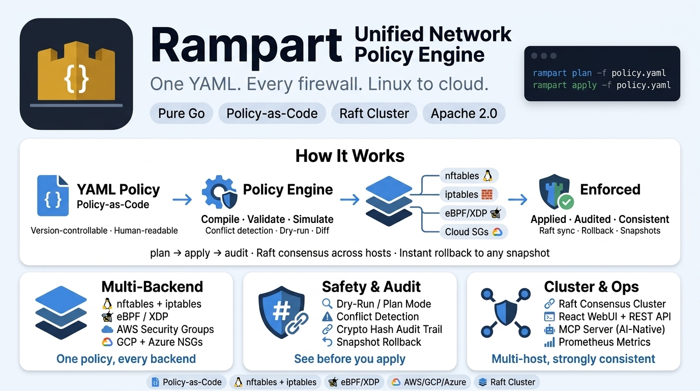

# Rampart

**Autonomous Network Defense & Policy Orchestration Platform**

<p align="center">
  
</p>

Rampart is a high-performance, autonomous network policy engine that abstracts the complexity of Linux firewalls (`nftables`, `eBPF/XDP`) and Cloud security groups (AWS, GCP, Azure) behind a single, intelligent YAML interface. 

Beyond simple filtering, Rampart features a built-in **Autonomous Sentinel** that analyzes traffic patterns in real-time to detect and mitigate threats automatically across distributed clusters.

## 🚀 Key Features

- **Unified Policy Engine:** Single YAML format for `nftables`, `iptables`, and `eBPF/XDP`.
- **Autonomous IPS (Sentinel):** Real-time threat scoring and automated cluster-wide IP banning.
- **Deep Packet Inspection (DPI):** Layer-7 filtering support for DNS, HTTP, and TLS SNI.
- **Multi-Cloud Orchestration:** Simultaneous rule deployment to AWS, GCP, and Azure.
- **Raft-based Clustering:** Secure, distributed policy synchronization with mTLS.
- **Self-Healing Watchdog:** Continuous backend monitoring and automatic state correction.
- **Cloud-Native Integration:** Dynamic IP sets with native Kubernetes pod discovery.
- **Observability:** Built-in Prometheus metrics, SIEM (Syslog) integration, and tamper-evident audit logs.
- **AI-Ready (MCP):** Native Model Context Protocol support for agentic security orchestration.

## 🏗️ Architecture

Rampart operates as a distributed control plane. It compiles abstract intent into backend-specific instructions, utilizing eBPF for the high-speed "fast-path" and traditional firewalls for complex stateful logic. The **Autonomous Sentinel** loop continuously feeds DPI signals into a risk-scoring engine to provide pro-active defense.

## 🛠️ Quick Start

### Build from source
```bash
make build
```

### Apply a unified policy
```bash
./rampart apply -f my-policy.yaml
```

### Start distributed autonomous node
```bash
export RAMPART_MCP_ENABLED=true
./rampart serve --config rampart.yaml
```

## 🔒 Security
Rampart implements industry-leading security standards:
- **mTLS:** Encrypted peer-to-peer cluster communication.
- **Capability Dropping:** Process operates with minimal Linux privileges.
- **Integrity:** Cryptographic hash-chaining for all audit logs.
- **Recovery:** Global panic handlers and atomic rollback support.

## 📖 Documentation
Detailed specifications, implementation guides, and roadmap can be found in the [.project/](.project/) directory.

## 📄 License
Rampart is licensed under the Apache License 2.0.
